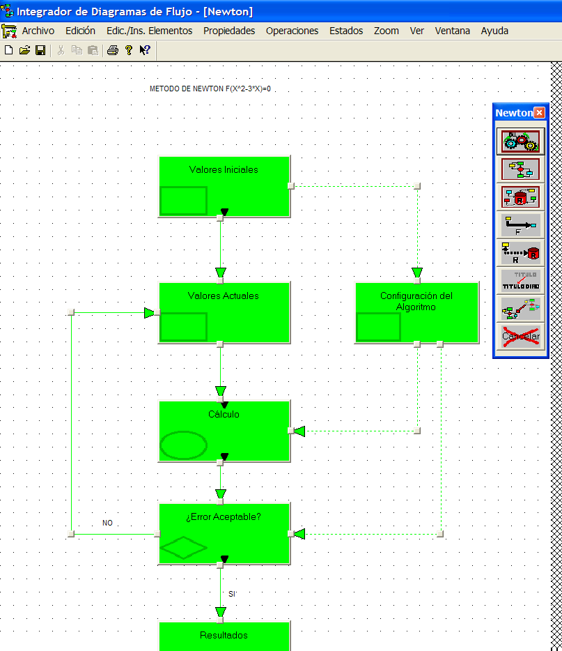
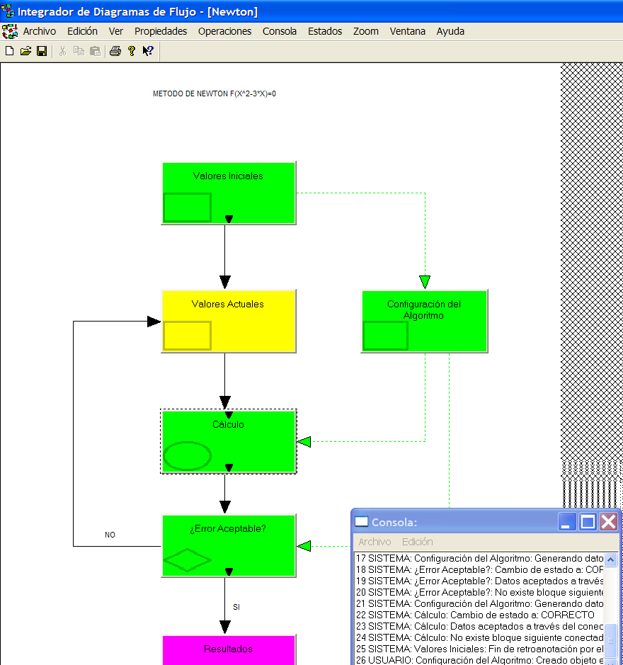

Integrador de Diagramas de Flujo (IDF)
========

Integrador de Diagramas de Flujo (IDF) es una aplicación visual para Windows XP o superior para el diseño y ejecución de diagramas de flujo a través de herramientas visuales,
el comportamiento está codificado en C++ y cargado dinámicamente a través de DLLs.

Es una aplicación terminada en 1998 con alguna pequeña modificación posterior.

Descarga e Instalación
------

Descarga el archivo zip de distribución en [SourceForge.net](https://sourceforge.net/projects/integdiagflujo/files/)

Crea una carpeta en el lugar que quieras y descomprime el zip dentro de ella. El ejecutable es Idf.exe.

Desinstalación
------

Elimina la carpeta que creaste en la instalación. Puede interesarte eliminar la asociación de archivos .dds y .dex

1. Windows XP: sigue estas [instrucciones](https://www.microsoft.com/resources/documentation/windows/xp/all/proddocs/en-us/win_fcab_reg_filetype_modify.mspx?mfr=true)

2. Windows Vista y superiores: ejecutar unassoc.exe incluido en la distribución

Funcionamiento
------

IDF (Idf.exe) es una aplicación Windows tipo MDI (Multi Document Interface), lo habitual de la época, tiene dos modos de funcionamiento:

1. Archivos (documentos) de diseño de diagramas 

   El resultado del diseño de un diagrama es un archivo XML llamado L.D.D. que describe el "layout" del diagrama y sus bindings con las librerías DLL que contienen el código a ejecutar.

   La herramienta permite el diseño visual de los diagramas (bloques y conectores) partiendo de cero o de un L.D.D. ya existente, generando si se quiere el LDD resultado del diseño, 
también es posible guardar el resultado en binario (serializado) con la extensión .dds asociada automáticamente a la aplicación en su primera ejecución.

   Es posible la creación de bloques-diagrama que tienen asociado otro diagrama que será otro documento en la aplicación, IDF se encarga de vincular automáticamente el ciclo 
de vida de ambos documentos abiertos (esta coordinación es atípica en una aplicación MFC). 

   A través del UI se obtiene el código .h y .cpp que servirá de punto de entrada al código del usuario del bloque programado en la DLL que lo contiene, dicha DLL se programa usando IDF headers y lib
creados con este fin (es posible programar múltiples bloques en una misma DLL y usar varias DLLs a la vez).

2. Archivos (documentos) de ejecución de diagramas

   A partir de un LDD es posible crear un diagrama "ejecutable", este diagrama no modificable a nivel de diseño, cargará las DLLs declaradas así como los bindings a las clases. 
Es posible guardar el resultado en binario (serializado) con la extensión .dex asociada automáticamente a la aplicación en su primera ejecución.

   De la misma manera que en diseño, en ejecución pueden estar dos o más documentos vinculados cuando hay una relación de jerárquica por la existencia de bloques-diagrama.

Documentación
------

Documentación en detalle se encuentra en la memoria de mi fin de carrera, es posible que algunos cambios realizados posteriormente no estén documentados tal y como
los nuevos nombres de las extensiones .dds y .dex, pero dichos cambios son menores.

[Portada](docs/Portada.doc?raw=true)

[Proyecto](docs/Proyecto.doc?raw=true)

[Diapositivas](docs/IDF_proy.ppt?raw=true)

Ejemplos
------

En el archivo de distribución se encuentran una serie de LDDs así como una DLL, DLLDiag.dll, con el código en C++ descrito en los LDDs.

Se recomienda usar el ejemplo Newton.xml y el ejemplo con subdiagramas Nwbase.xml (que se vincula a su vez a Newton.xml). Es posible que haya que cambiar paths (para localizar la DLL) 
para poder ejecutar ambos ejemplos.

Licencias
------

* Código fuente de Idf.exe: GNU GPL v3.0

* Código fuente de IdfLib (necesario para el desarrollo de DLLs): GNU LGPL v3.0

* Código fuente de DLLDiag : MIT, Apache v2, la que te de la gana

Autor y Copyright
------

Jose María Arranz Santamaría (Spanish citizen)

Historia
------

IDF fue mi proyecto fin de carrera desarrollado en la Escuela Técnica Superior de Ingenieros Industriales de Madrid (ETSIIM), no recuerdo el año en el que lo comencé en el 
Departamento de Electrónica, la finalidad era poder simular algoritmos a través de diagramas de flujo con el fin de ser útil para la programación de circuitos digitales.

IDF fue la aplicación que me inclinó de forma definitiva hacia el desarrollo software en el sentido más abierto en vez de seguir el camino de la micro-electrónica digital
(que hoy día es también básicamente software). El desarrollo software de propósito general me mostraba un mundo muchísísimo más abierto y de alto nivel que la programación
de circuitos electrónicos, pronto IDF se convirtió en una herramienta totalmente genérica sin ninguna vinculación directa con la microelectrónica, al mismo tiempo
que me aportaba experiencia para acceder a trabajos de "programador". Después de tantos años no me arrepiento a pesar del usual maltrato de la profesión de programador,
en muchos casos considerado como un "peón albañil" o un transitorio entretenimiento para niños avispados.

IDF fue mi primer contacto "serio" con el desarrollo software aunque en el instituto de secundaria diera mis primeros pasos con el BASIC de un Amstrad, GWBASIC en PCs y un 
poquito de TurboPascal 3.0 en dichos PCs. Ese primer contacto fue entrar por la puerta grande, programación de GUIs (Win32 y MFC) orientado a objetos en C++,  estrenando el flamante 
Microsoft Visual C++ 1.0 que empezó a convertir a Microsoft en el líder indiscutible en herramientas de desarrollo software para Windows desplazando a Borland.

Pero la puerta grande tenía un enorme agujero, el sistema operativo, creo recordar Windows 95 o anterior, Windows 95 era un sistema operativo mediocre, mediocre no tanto debido a la incompetencia de los 
programadores de Microsoft sino a la herencia envenenada de construir un sistema operativo moderno sobre MSDOS, por ejemplo era incapaz de liberar las DLLs enlazadas dinámicamente
cuando la aplicación cargadora moría, ello me obligaba a apagar el ordenador y volver a cargar el sistema CADA VEZ que ejecutaba la aplicación y ésta fallaba. Afortunadamente fui capaz de
desarrollar un sencillo programa que descargaba "manualmente" dichas DLLs, tiempo más tarde Windows NT sacó a Windows de la mediocridad poniendo MSDOS en su sitio (encima de Windows 
no debajo).

Por razones de necesidad económica acepté becas y posteriormente contratos de trabajo en el Laboratorio de Informática de la ETSIIM donde me dediqué fundamentalmente a hacer webs en C++ (sí en C++)
usando ObjectStore y su extensión para el desarrollo web y posteriormente en Java (en torno al año 1999 quizás). IDF quedó parado durante algunos años.

Posteriormente con el fin de terminar la carrera retomé IDF y lo terminé en el Laboratorio de Informática y lo presenté como fin de carrera a través de dicho departamento en 1998.

Años después intenté continuarlo con el fin incluso de llegar a venderlo pero no me interesaba suficiente.

El estado actual del código compila al menos en Visual C++ 2005 y requiere Windows XP como mínimo (ajustes realizados antes de subir a GitHub).

A la hora de valorar la calidad del código fuente, se benevolente y ten en cuenta que es el resultado de un jovencito aprendiz de programador, aunque no se si hoy día soy mucho mejor
técnico que en aquel entonces :) 
